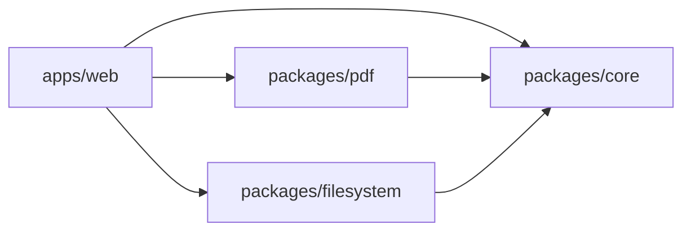

# System architecture (Phase 1)

```text
apps/web               → React shell (UI, Zustand)
packages/core          → Result, errors, CommandDefinition
packages/filesystem    → FS adapter + file-management commands
packages/pdf           → PDF commands (pdf-lib)
packages/docx          → Practical DOCX merge + text preview
packages/orchestration → Unified registry + AI-safe catalog
```



## Invariants

- Document-processing logic lives in packages, not coupled to React.
- Web is a shell; desktop will be another shell later.
- Document bytes are not uploaded to an application backend.
- Phase 1 command surface: `MERGE_FILES` only.
- Filesystem access goes through `FilesystemAdapter` (`packages/filesystem`). Browser and future desktop adapters share the same contract.

## Deferred packages

`docx`, `ai`, `orchestration`, `ui` (shared), and `apps/desktop` are added when their phases begin.
