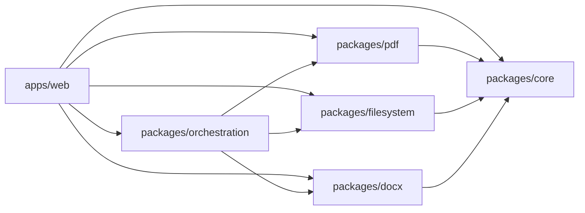

# System architecture (web — current)

```text
apps/web               → React shell (UI, Zustand, PWA, public pages, i18n)
  src/i18n             → Locale catalogs, LocaleProvider, path helpers, t()
packages/core          → Result, errors, CommandDefinition
packages/filesystem    → FS adapter + file-management commands
packages/pdf           → PDF commands (pdf-lib) + compress
packages/docx          → Practical DOCX merge, preview, convert
packages/orchestration → Unified registry + AI-safe catalog
```



## Invariants

- Document-processing logic lives in packages, not coupled to React.
- Web is a shell; desktop will be another shell later.
- Document bytes are not uploaded to an application backend.
- Filesystem access goes through `FilesystemAdapter` (`packages/filesystem`). Browser and future desktop adapters share the same contract.
- Future LocalDocu AI may only select from the orchestration catalog — never invent capabilities or execute FS actions directly.
- UI copy for the web shell lives in `apps/web/src/i18n/locales/` (English source of truth; other locales fall back to English). Route path slugs stay English; locale is a URL prefix except for `en`.

## Current command surface (web)

Shipped via `@localdoc/orchestration` (AI-selectable catalog ready; **interpreter Off** on web):

- PDF: merge, split, extract, delete pages, rotate, reorder, compress
- Word: practical DOCX merge, DOC/DOCX → PDF (text-oriented)
- Filesystem: sort, filter, rename, copy, move, create folder, export

Exact names and schemas: `packages/orchestration/src/catalog.ts`.

## Deferred

| Package / app | Status |
|---------------|--------|
| `packages/ai` | Not started — LocalDocu AI interpreter (desktop) |
| `apps/desktop` | Not started — Tauri shell |
| Shared `ui` package | Not extracted; styles live in `apps/web` |
| Arabic / RTL UI | Not started — other locales shipped |

## Hosting

Production static SPA on Vercel (`apps/web`). Security headers, SPA rewrites, and `VITE_SITE_URL` defaults live in `apps/web/vercel.json`. Production origin: `https://www.localdocu.org`.
